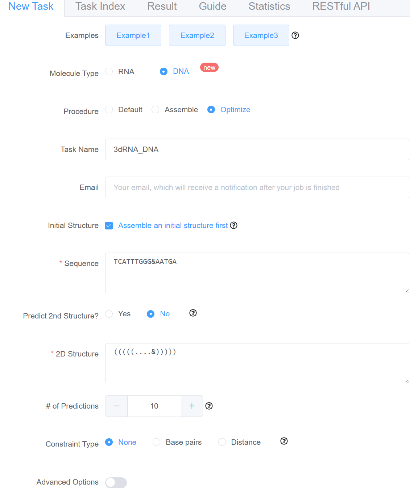

# 3dRNA/DNA

<a herf=http://biophy.hust.edu.cn/new/3dRNA>Click here to visit 3dRNA/DNA web server</a>

You can click "Example" to show example:

    

You can find using instructions in the Guide page:

    

You can find tips for each options when click .

### Here are some examples. 
*The parameters are in the table and the options you need to choose are showing in the picture.*

- Using Default procedure to predict a Linear RNA
    <table border="2" >
        <tr>
            <th width="25%" align=left>Key</th>
            <th align=left>Value</th>
        </tr>
        <tr>
            <td width="25%" align=left>Molecule Type</td>
            <td align=left>RNA</td>
        </tr>
        <tr>
            <td width="25%" align=left>RNA Type</td>
            <td align=left>Linear RNA</td>
        </tr>
        <tr>
            <td width="25%" align=left>Procedure</td>
            <td align=left>Default</td>
        </tr>
        <tr>
            <td width="25%" align=left>Task Name</td>
            <td align=left>3dRNA_DNA</td>
        </tr>
        <tr>
            <td width="25%" align=left>Email</td>
            <td align=left>example@xxx.com</td>
        </tr>
        <tr>
            <td width="25%" align=left>Sequence</td>
            <td align=left>GGGGAUUGAAAAUCCCC</td>
        </tr>
        <tr>
            <td width="25%" align=left>Predict 2nd Strucure</td>
            <td align=left>No</td>
        </tr>
        <tr>
            <td width="25%" align=left>2D Structure</td>
            <td align=left>((((((.....))))))</td>
        </tr>
        <tr>
            <td width="25%" align=left>Number of Predictions</td>
            <td align=left>5</td>
        </tr>
        <tr>
            <td width="25%" align=left>Number of Samplings</td>
            <td align=left>100</td>
        </tr>
        <tr>
            <td width="25%" align=left>Exclude PDBs</td>
            <td align=left>1j4y</td>
        </tr>
        <tr>
            <td width="25%" align=left>Loop Building Method</td>
            <td align=left>Bi-residue</td>
        </tr>
        <tr>
            <td width="25%" align=left>Minimization</td>
            <td align=left>Yes</td>
        </tr>
    </table>

    

        
    

---

- Using Assemble procedure to predict a Circular RNA
    <table border="2" >
        <tr>
            <th width="25%" align=left>Key</th>
            <th align=left>Value</th>
        </tr>
        <tr>
            <td width="25%" align=left>Molecule Type</td>
            <td align=left>RNA</td>
        </tr>
        <tr>
            <td width="25%" align=left>RNA Type</td>
            <td align=left>Circular RNA</td>
        </tr>
        <tr>
            <td width="25%" align=left>Procedure</td>
            <td align=left>Assemble</td>
        </tr>
        <tr>
            <td width="25%" align=left>Task Name</td>
            <td align=left>cirRNA</td>
        </tr>
        <tr>
            <td width="25%" align=left>Email</td>
            <td align=left>example@xxx.com</td>
        </tr>
        <tr>
            <td width="25%" align=left>Sequence</td>
            <td align=left>
            GGUCAGUUUGAAAAGGAGGAUCGAGCUCACUGUGGAGUAUCCAUG 
            GAGAUGUGGAGCCUUGUCACCAACCUCUAACUGCAGAACUGGGAU 
            GUGGAGCUGGAAGUGCCUCCUCUUCUGGGCUGUGCUGGUCACAGC 
            CACACUCUGCACCGCUAGGCCGUCCCCGACCUUGCCUGAACAAG 
            </td>
        </tr>
        <tr>
            <td width="25%" align=left>Predict 2nd Strucure</td>
            <td align=left>Yes</td>
        </tr>
        <tr>
            <td width="25%" align=left>2nd Structure Prediction Method</td>
            <td align=left>RNAfold</td>
        </tr>
        <tr>
            <td width="25%" align=left>Number of Predictions</td>
            <td align=left>5</td>
        </tr>
        <tr>
            <td width="25%" align=left>Number of Samplings</td>
            <td align=left>No sampling</td>
        </tr>
        <tr>
            <td width="25%" align=left>Exclude PDBs</td>
            <td align=left>Null</td>
        </tr>
        <tr>
            <td width="25%" align=left>Loop Building Method</td>
            <td align=left>Bi-residue</td>
        </tr>
        <tr>
            <td width="25%" align=left>Minimization</td>
            <td align=left>Yes</td>
        </tr>
    </table>

    

        
    

---

- Using Optimize procedure to predict a DNA
    <table border="2" >
        <tr>
            <th width="25%" align=left>Key</th>
            <th align=left>Value</th>
        </tr>
        <tr>
            <td width="25%" align=left>Molecule Type</td>
            <td align=left>DNA</td>
        </tr>
        <tr>
            <td width="25%" align=left>Procedure</td>
            <td align=left>Optimize</td>
        </tr>
        <tr>
            <td width="25%" align=left>Task Name</td>
            <td align=left>3dRNA_DNA</td>
        </tr>
        <tr>
            <td width="25%" align=left>Email</td>
            <td align=left>Null</td>
        </tr>
        <tr>
            <td width="25%" align=left>Sequence</td>
            <td align=left>TCATTTGGG&AATGA</td>
        </tr>
        <tr>
            <td width="25%" align=left>Predict 2nd Strucure</td>
            <td align=left>No</td>
        </tr>
        <tr>
            <td width="25%" align=left>2D Structure</td>
            <td align=left>(((((....&)))))</td>
        </tr>
        <tr>
            <td width="25%" align=left>Number of Predictions</td>
            <td align=left>10</td>
        </tr>
        <tr>
            <td width="25%" align=left>Constraint Type</td>
            <td align=left>None</td>
        </tr>
        <tr>
            <td width="25%" align=left>Exclude PDBs</td>
            <td align=left>Null</td>
        </tr>
        <tr>
            <td width="25%" align=left>Loop Building Method</td>
            <td align=left>Bi-residue</td>
        </tr>
        <tr>
            <td width="25%" align=left>Minimization</td>
            <td align=left>Yes</td>
        </tr>
    </table>

    

        
    
